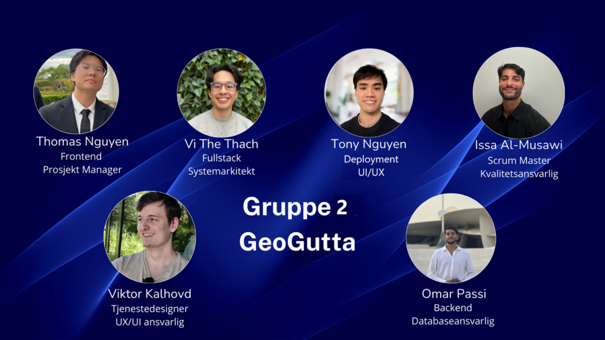

# GeoGPT

## Oversikt

GeoGPT er et MVP (Minimum Viable Product) designet for å gjøre geodata mer tilgjengelig og brukervennlig sammenlignet med den originale Geonorge.no-portalen. Ved å utnytte moderne AI og webteknologier gir GeoGPT et intuitivt grensesnitt for å samhandle med geodata gjennom naturlige språkspørringer.

## Gruppen



## Tech Stack

- **Frontend**: Next.js, TypeScript og Tailwind CSS for et responsivt og moderne brukergrensesnitt
- **Backend**: Python med WebSocket for sanntidskommunikasjon
- **AI/ML**: RAG (Retrieval-Augmented Generation) arkitektur med LangChain og LangGraph
- **Database**: pgvector for effektiv vektorlagring og -henting
- **Deployment**: Traefik for tjenestehåndtering og ruting
- **Containerization**: Docker og docker-compose for enkel implementering

## Kom i gang

### Forutsetninger

- Docker og docker-compose installert
- Miljøvariabler satt for API-nøkler (se nedenfor)

### Miljøvariabler

Sørg for å sette følgende miljøvariabler før du kjører docker-compose. Du kan kopiere `env.example` til en ny `.env`-fil og fylle ut med dine egne API-nøkler:

```bash
cp env.example .env
# Rediger .env-filen med dine egne API-nøkler
```

- `OPENAI_API_KEY`: Din OpenAI API-nøkkel
- `AZURE_GPT_API_KEY`: Din Azure OpenAI API-nøkkel
- `AZURE_GPT_ENDPOINT`: Endepunktet for din Azure OpenAI-tjeneste
- `AZURE_EMBEDDING_API_KEY`: Din Azure Embedding API-nøkkel

Eksempel på `.env`-fil (husk å erstatte verdiene med dine egne nøkler):

```
DB_HOST=localhost
DB_PORT=5432
DB_NAME=postgres
DB_USER=asd
DB_PASSWORD=asd

AZURE_GPT_API_KEY=din-api-nøkkel-her
AZURE_GPT_ENDPOINT=https://ditt-endepunkt.openai.azure.com/openai/deployments/gpt-4/chat/completions?api-version=2024-08-01-preview
AZURE_EMBEDDING_BASEURL=https://ditt-endepunkt.openai.azure.com/
AZURE_EMBEDDING_API_KEY=din-embedding-api-nøkkel-her
AZURE_EMBEDDING_ENDPOINT=https://ditt-endepunkt.azure.com/openai/deployments/text-embedding-3-large/embeddings?api-version=2023-05-15
```

### Kjøre applikasjonen

Hele applikasjonen kan nå kjøres ved hjelp av docker-compose:

```bash
# Bygg containere
docker-compose build

# Start applikasjonen
docker-compose up

# Alternativt, bygg og start i ett trinn
docker-compose up --build
```

Dette vil:

1. Starte vektordatabasen (pgvector)
2. Starte backend-serveren som automatisk setter inn CSV-data i vektordatabasen
3. Starte frontend-applikasjonen

## Arbeide med data

Prosjektet inneholder allerede nødvendige CSV-datasett som automatisk settes inn i vektordatabasen ved oppstart:

- `cleaned_metadata.csv`: Forhåndsbehandlet metadata for geodata
- `all_columns_vectorized.csv`: Vektorisert data klar for similaritetssøk

### Legge til nye datasett

Hvis du trenger å legge til flere datasett:

1. Plasser dine nye datafiler i prosjektet
2. Kjør vektoriseringsprosessen manuelt ved å kjøre `create_vector.py`-skriptet:

```bash
python scripts/create_vector.py
```

Dette vil opprette en ny `all_columns_vectorized.csv`-fil som inneholder vektorrepresentasjoner av tekstdataene.

3. Start applikasjonen på nytt med `docker-compose up`

## Om prosjektet

GeoGPT transformerer måten brukere samhandler med geodata på ved å tilby:

- Naturlig språkspørringer for geodataressurser
- Kontekstuell forståelse av geografisk informasjon
- Mer intuitiv og tilgjengelig presentasjon sammenlignet med tradisjonelle geodataportaler
- Sanntidssvar drevet av AI

Systemet bruker RAG-arkitektur for å kombinere kraften i store språkmodeller med henting fra en spesialisert vektordatabase med geodata, noe som sikrer at svarene er både nøyaktige og relevante for geografiske spørsmål.
